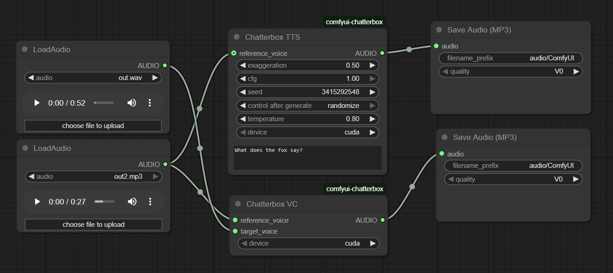

# if_chatterbox for ComfyUI

This repository provides a ComfyUI wrapper for the [Chatterbox TTS model by Resemble AI](https://huggingface.co/ResembleAI/chatterbox).

Try a live demo on [Hugging Face Spaces](https://huggingface.co/spaces/ResembleAI/Chatterbox)!



## Installation

1.  **Install ComfyUI**: If you haven't already, follow the official instructions to [install ComfyUI](https://docs.comfy.org/get_started).

2.  **Clone this Repository**:
    *   Navigate to your `ComfyUI/custom_nodes/` directory.
    *   Clone this repository:
        ```bash
        git clone https://github.com/if-ai/if_chatterbox.git
        ```

3.  **Install Dependencies**:
    *   Navigate into the new `if_chatterbox` directory: `cd if_chatterbox`
    *   Install the required Python packages. You can do this by running:
        ```bash
        pip install numpy resampy librosa s3tokenizer transformers diffusers omegaconf conformer safetensors
        ```
    *   **Note on Watermarking**: The original model supports `resemble-perth` for audio watermarking. This dependency is optional and may have compatibility issues with Python 3.12 and newer. If you wish to install it, run `pip install resemble-perth`.

4.  **Restart ComfyUI**: Start or restart ComfyUI. The new nodes should appear in the "audio" category.

## Models

The node will attempt to download the required model files automatically from Hugging Face on the first run. If this fails, or if you prefer to manage the models manually for offline use or shared storage (e.g., on Modal), you can download them from the [model's repository](https://huggingface.co/ResembleAI/chatterbox/tree/main).

Place the downloaded model files into one of the following directories:

*   `<ComfyUI_root>/models/chatterbox/`
*   `<ComfyUI_root>/public_models/chatterbox/` (Recommended for shared/cloud setups)
*   `<ComfyUI_root>/private_models/chatterbox/`

Alternatively, you can place the models in any custom directory and set the `CHATTERBOX_CKPT_DIR` environment variable to point to that path.

## Nodes

This package provides two main nodes:

-   **Chatterbox TTS**: A powerful Text-to-Speech node with zero-shot voice cloning and emotion/pace control.
-   **Chatterbox VC**: A Voice Conversion node to transform the voice in one audio file to match a target voice.

## Credits

*   This node is a wrapper for the open-source [Chatterbox model](https://huggingface.co/ResembleAI/chatterbox) by [Resemble AI](https://www.resemble.ai/).
*   This ComfyUI integration is maintained at [if-ai/if_chatterbox](https://github.com/if-ai/if_chatterbox).
